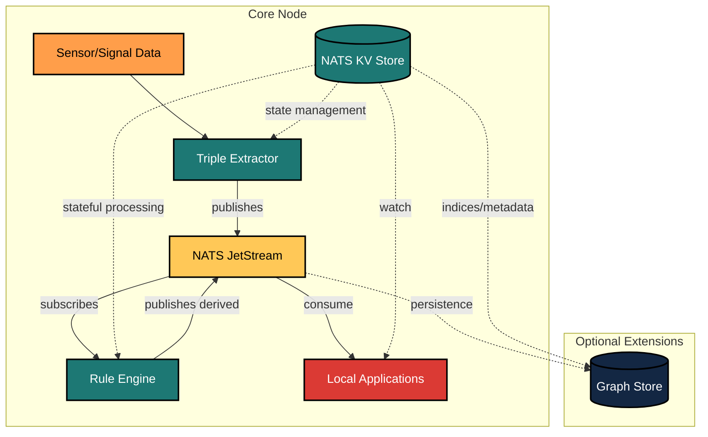

# KraphT Knowledge Graph From Triples

WORK IN PROGRESS.  **Expect breaking changes until further notice.**

Inspired by real-world needs for fast, explainable, streaming knowledge graphs.  KraphT helps teams extract meaning from structured events, connect facts into a living graph, and automate reasoning at scale.

**KraphT** is a lightweight, event-driven knowledge graph engine for transforming structured data into triples, applying human-readable rules, and building real-time property graphs. It is designed for use by resource constrained teams in streaming pipelines, entity enrichment, and explainable reasoning — without requiring RDF, OWL, or SPARQL.

---

## Features

- **Triple extraction** from structured logs, metrics, and JSON events
- **Rule-based inference** using composable Go interfaces
- **Property graph modeling** without semantic web complexity
- **Event-driven architecture** built on [NATS](https://nats.io) and JetStream
- **Pluggable entity store** using KV, SQL, or vector DB backends
- **Optional LLM/agent integration** for rule authoring or enrichment
- **Optional RDF/OWL compatibility** for integration with existing semantic web tools

---

## Use Cases

### Field Science Data Collection

- **Ocean Science**: Monitor marine ecosystems with distributed buoys and sensors
- **Climate Research**: Track environmental changes across remote stations
- **Agricultural Monitoring**: Analyze soil, crop, and weather patterns

### System and Application Observability

- **Metric Pattern Analysis**: Detect performance anomalies across correlated metrics
- **Log Correlation**: Connect disparate system logs into causal event chains
- **Service Dependency Mapping**: Automatically build service relationship graphs

### Other Applications

- Event-driven detection and response pipelines
- Research data integration and scientific graph building
- Entity relationship modeling

---

## Architecture Overview



KraphT runs as a fully functional unit on a single edge device with all components communicating via local NATS topics. This self-contained design allows operation in disconnected environments while maintaining the event-driven architecture.

---

## Quick Start

### Prerequisites

- Go 1.24+
- NATS server with JetStream enabled
- Docker (optional for local testing)

### Clone the Repo

```bash
git clone https://github.com/c360studio/krapht.git
cd krapht
```

### Build

```bash
go build -o krapht ./cmd/krapht
```

### Run Locally

```bash
./krapht --config ./config/dev.json
```

You can simulate events using the `examples/` directory.

---

## Repository Structure

```bash
cmd/                Main CLI for running the engine
pkg/
  triple/           Core types and extraction logic
  rules/            Rule interface and default rule set
  entity/           Entity modeling and graph persistence
  stream/           NATS event adapters
  plugins/          Optional rule plugins and LLM integration
examples/           Sensor data and test flows
docs/               Architecture and design notes
```

---

## Rule Example

A simple Go rule that fires when surface temperature exceeds 30°C:

```go
func (r HeatRule) Evaluate(data SensorData) []Triple {
  if data.SensorType == "temperature" && data.Value > 30 && data.Metadata["depth"] == "0" {
    return []Triple{{
      Subject: data.SourceID,
      Predicate: "alert",
      Object: "surface_heat_anomaly",
    }}
  }
  return nil
}
```

Rules are compiled and registered via plugin or built-in registry.

---

## Integration with LLMs and Agents

KraphT supports safe submission of rule logic via:

- Plugin interface: `RulePlugin`
- Sandbox execution using [Yaegi](https://github.com/traefik/yaegi)
- Optional REST API for dry-run evaluation and metadata logging

See `docs/llm_integration.md` for implementation patterns.

---

## Configuration

You can configure:

- Input subjects (e.g., `event.raw`, `sensor.event`)
- Rule sets to apply
- Backend for storing or exporting triples
- Entity indexing strategy

See `config/` for JSON configuration templates.

---

## Roadmap

1. [ ] **Core Pipeline**: Basic pipeline with NATS integration
2. [ ] **Triple Extraction**: Configurable extraction from structured events
3. [ ] **Entity Resolution**: Entity resolution with local/global contexts
4. [ ] **Rule Engine**: Pattern matching for triple streams
5. [ ] **UI Components**: Configuration and visualization interfaces
6. [ ] **Advanced Analytics**: Optional SQL and vector search integrations
7. [ ] **Data Distribution Layer**: Advanced NATS patterns for aggregation and federation

---

## Contributing

Contributions are welcome. Please open an issue or submit a pull request.

---

## License

MIT License. See `LICENSE` for details.

---
