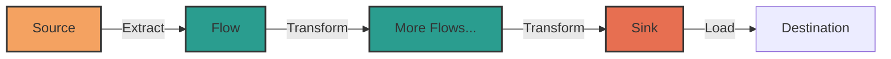
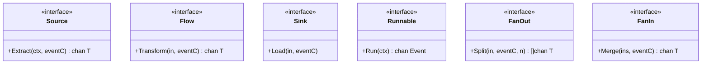
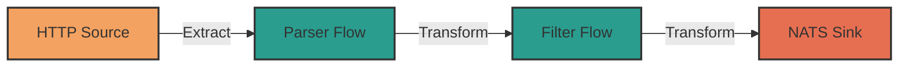
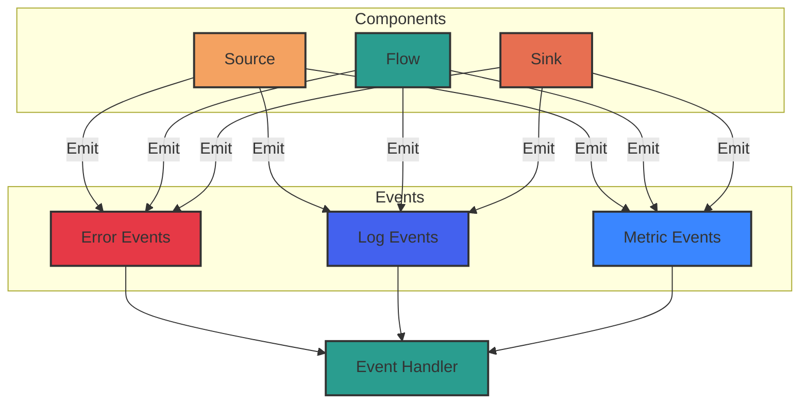
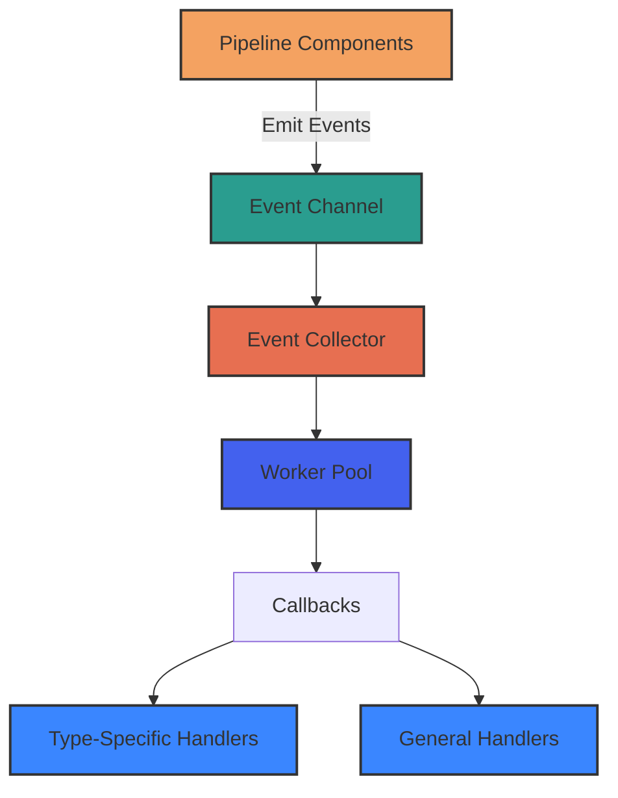

# Pipeline Package

The pipeline package provides a flexible and composable data processing pipeline implementation built around Go's channels. It enables building data processing workflows by connecting reusable components.

## Core Concepts

The pipeline is composed of three main components:

1. **Source**: Starting point that extracts data from an input
2. **Flow**: Transforms data passing through the pipeline
3. **Sink**: Endpoint that loads processed data to its final destination



### Key Interfaces

The pipeline package is built on a foundation of interfaces that define behaviors rather than concrete implementations. This design follows the principle of "programming to an interface, not an implementation," which promotes flexibility, testability, and modularity in the codebase.

These interfaces enable a form of polymorphism where any type that satisfies the contract can be used interchangeably within the pipeline, regardless of its internal implementation.



Each interface serves a specific purpose in the pipeline architecture:

- **Source**: Decouples data extraction from processing, allowing new data sources to be added without modifying downstream components.
- **Flow**: Enables composition of transformations in a chain, following the pipes and filters architectural pattern.
- **Sink**: Abstracts the final destination of data, supporting multiple output targets without changing upstream logic.
- **Runnable**: Provides a common orchestration mechanism for different pipeline configurations.
- **FanOut/FanIn**: Implements scatter-gather patterns for parallel processing and aggregation.

This design also facilitates easier testing through mocking and stubbing of components. By depending on behaviors rather than implementations, individual components can be tested in isolation with mock implementations of their dependencies.

The generic typing (`Source[T]`, `Flow[In, Out]`, etc.) leverages Go's type parameters to provide compile-time type safety while maintaining the flexibility of the interface-based design. This creates a balance between type safety and abstraction that helps prevent runtime errors while preserving architectural flexibility.

## Common Pipeline Patterns

### Linear Pipeline

The simplest pipeline pattern connects one source to a sequence of flows and finally to a sink.



## Event System

The pipeline uses an event system for error handling, logging, and metrics. Each component can emit events that are collected and processed.



To prevent pipeline components from blocking when sending events, the package provides the SendEvent utility function.

Example useage:

```go

pipeline.SendEvent(eventC, pipeline.NewLogEvent(
    "Component Name",
    pipeline.LevelInfo,
    "Processing item completed",
))

```

### Event Collector

The pipeline provides an `EventCollector` component that centralizes event processing and handling. This collector creates a systematic way to process events from all pipeline components through configurable callbacks.



The EventCollector offers several benefits:

- Configurable Workers: Configure concurrent processing with multiple worker goroutines
- Buffered Collection: Control backpressure with adjustable channel buffer size
- Typed Callbacks: Register handlers for specific event types (errors, logs, metrics)
- General Callbacks: Process all events regardless of type
- Thread Safety: Properly synchronizes event processing across concurrent operations

Example collector setup:

```go
collector := pipeline.NewEventCollector(
    pipeline.WithBufferSize(100),
    pipeline.WithWorkers(2),
    pipeline.WithTypedCallback(pipeline.EventError, handleErrorEvent),
    pipeline.WithTypedCallback(pipeline.EventLog, handleLogEvent),
    pipeline.WithTypedCallback(pipeline.EventMetric, handleMetricEvent),
)

// Get event channel to pass to pipeline components
eventChan := collector.Collect()

// Ensure proper cleanup when done
defer collector.Close()
```

The collector integrates with all pipeline components through a shared event channel, providing centralized monitoring and handling of operational events.

## Basic Usage Example

Here's a simple example of creating a pipeline that reads from a mock source of ints, processes the data, buffer, and logs the output:

```go
// Example demonstrating how to build a data processing pipeline using the pipeline
// package components. This example creates a mock source that passes a slice of ints to a flow
// that converts each int to a string, and then sends the result to a sink that logs the output.
package main

import (
  "context"
  "fmt"
  "log"
  "os"
  "os/signal"
  "strconv"
  "syscall"
  "time"

  "github.com/witfoo/krapht/pkg/pipeline"
  "github.com/witfoo/krapht/pkgpipeline/flow"
  "github.com/witfoo/krapht/pkgpipeline/mock"
  "github.com/witfoo/krapht/pkgpipeline/sink"
)

func main() {
  // Create root context with cancellation for the entire application
  ctx, cancel := context.WithCancel(context.Background())
  defer cancel()

  // Set up signal handling for graceful shutdown
  sigCh := make(chan os.Signal, 1)
  signal.Notify(sigCh, syscall.SIGINT, syscall.SIGTERM)
  go func() {
    sig := <-sigCh
    fmt.Printf("Shutdown signal received (%s), stopping pipeline...\n", sig)
    cancel()
  }()

  // Run the pipeline and handle any errors
  if err := runPipeline(ctx); err != nil {
    log.Fatalf("Pipeline error: %v", err)
  }
}

// runPipeline builds and runs the data processing pipeline.
// It returns an error if any component fails to initialize or if
// the pipeline encounters a fatal error during operation.
func runPipeline(ctx context.Context) error {
  // Create a simple source that outputs ints
  intSource := mock.NewSourceImpl([]int{1, 2, 3, 4, 5})

  // Create a processing flow to transform the data
  // In this case, we are using a simple map function that converts int to string
  addOneFlow, err := flow.NewMap(func(in int) (string, error) {
    // Simulate a transformation, e.g., converting raw data to graph data
    return strconv.Itoa(in), nil
  })

  if err != nil {
    return fmt.Errorf("failed to create data flow: %w", err)
  }

  // Create a buffer to manage backpressure
  buffer := flow.NewBuffer[string](100)

  // Create a logger sink
  logger := sink.NewLogger[string](log.New(os.Stdout, "PIPELINE: ", log.LstdFlags))

  
  // Create an event collector with callbacks for different event types
  collector := pipeline.NewEventCollector(
    pipeline.WithBufferSize(100),
    pipeline.WithWorkers(2),
    pipeline.WithTypedCallback(pipeline.EventError, handleErrorEvent),
    pipeline.WithTypedCallback(pipeline.EventLog, handleLogEvent),
    pipeline.WithTypedCallback(pipeline.EventMetric, handleMetricEvent),
  )
  // Create channel for each stage to use for sending events
  eventChan := collector.Collect(ctx)
  // Clean up when done
  defer collector.Close()

  // Run the pipeline manually since we're using a simple topology
  go func() {
    // Extract data from source
    sourceOut := intSource.Extract(ctx, eventChan)
    // Transform data through flow
    flowOut := addOneFlow.Transform(sourceOut, eventChan)
    // Buffer the output to handle backpressure
    bufferedOut := buffer.Transform(flowOut, eventChan)
    // Load data into sink
    // Blocks here until context is cancelled
    logger.Load(bufferedOut, eventChan)
  }()

  // Wait for context cancellation
  <-ctx.Done()
  return ctx.Err()
}

// handleErrorEvent processes error events from the pipeline.
func handleErrorEvent(e pipeline.Event) {
  errorEvent, ok := e.(*pipeline.ErrorEvent)
  if !ok {
    log.Printf("Received non-error event in error handler: %T", e)
    return
  }

  log.Printf("ERROR: %s", errorEvent.Error())
}

// handleLogEvent processes log events from the pipeline.
func handleLogEvent(e pipeline.Event) {
  logEvent, ok := e.(*pipeline.LogEvent)
  if !ok {
    return
  }
  log.Println(logEvent.String())
}

// handleMetricEvent processes metric events from the pipeline.
func handleMetricEvent(e pipeline.Event) {
  metricEvent, ok := e.(*pipeline.MetricEvent)
  if !ok {
    return
  }
  log.Printf("METRIC %s: %.2f", metricEvent.Name(), metricEvent.Value())
}

```

## Available Components

### Sources

- HTTP Server: Receives data via HTTP
- NATS Stream: Consumes from JetStream subject

### Flows

- Buffer: Very simple channel based buffer
- Map: Transforms data
- Filter: Filters data based on conditions
- FilterMap: Combines filter and map
- Passthrough: Passes data unchanged

### Sinks

- Logger: Logs prettified data
- NoOp: Discards data
- NATS Stream: Publishes to NATS stream

## Best Practices

1. Always handle errors through the event channel
2. Use buffers between components with different processing speeds
3. Implement graceful shutdown by handling context cancellation
4. Keep components small and focused on a single responsibility
5. Reuse common components across different pipelines
